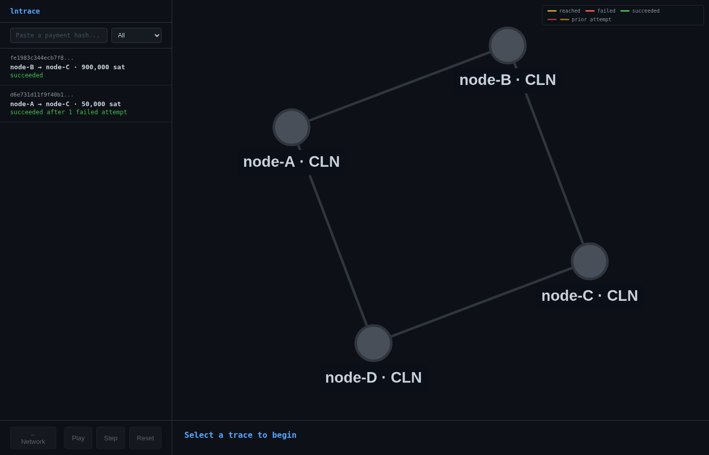
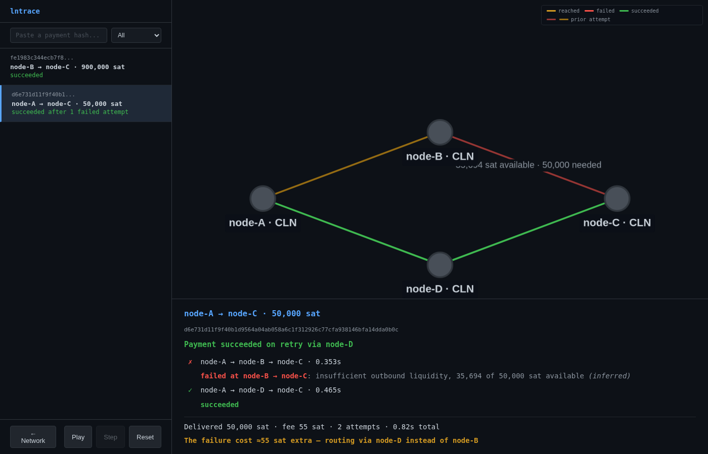
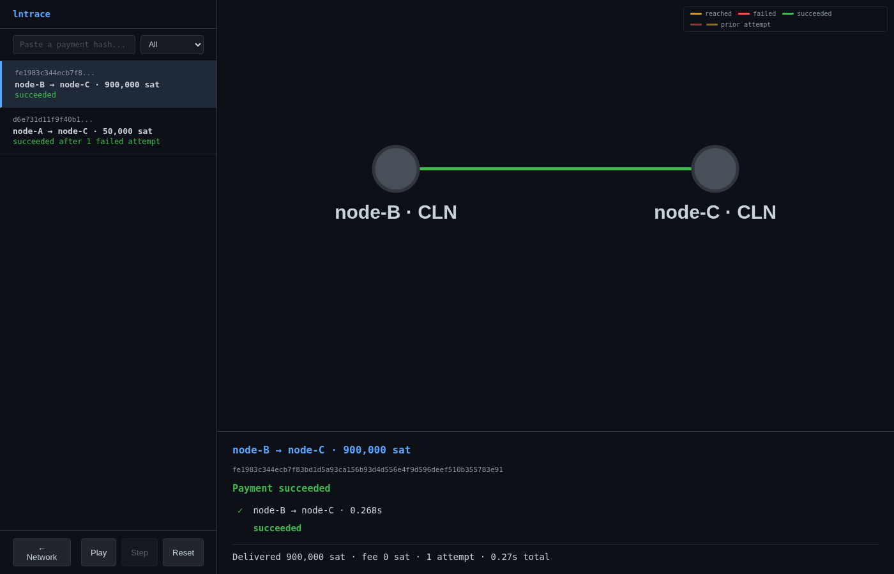

# lntrace

[](https://github.com/juliusjulyp/lntrace/actions/workflows/ci.yml)





`lntrace` is a payment debugging tool for the Bitcoin Lightning Network, written in Rust. It collects notifications from Lightning nodes, stitches their events into a single trace per payment, and tells you exactly which hop failed and why — including reroutes where the sender retries on a different path. Currently supports CLN, with LDK and LND adapters planned.

---

## Current status

The library, CLN adapter, correlator, and CLI compile and pass all the 40 tests. The CLN adapter uses typed deserialization via `cln-rpc 0.7` notification structs. The correlator pairs each path attempt with its result by `(groupid, partid)`, merges cross-node forward events for failure enrichment, and infers the actual cause of `temporary_channel_failure` from channel state snapshots.

| Component | Status | Description |
|---|---|---|
| `lntrace` library | done | Types, JSONL collector, correlator, graph builder, BOLT 4 decoder |
| CLI | done | `events`, `trace`, `replay`, `explain`, `ui` subcommands |
| Replay UI | done | Cytoscape.js graph with fcose layout, route focus, search/filter, step/play animation, summary panel |
| CLN adapter | done | Typed xpay deserialization, listpeerchannels polling, recorder plugin |
| Correlator | done | Per-shard attempt pairing, direction-aware hop matching, cause inference from channel snapshots |
| Docker lab | done | 4-node diamond CLN v26.06.8 lab with success, reroute, and total-failure scenarios |

---

## Getting started

### Build

```bash
git clone https://github.com/juliusjulyp/lntrace
cd lntrace
cargo build
cargo test --all
```

### Try the CLI

```bash
# decode a BOLT 4 failure code
cargo run -p lntrace-cli -- explain 0x1007

# list events from a fixture directory
cargo run -p lntrace-cli -- events --log fixtures/4node-reroute/

# show all payment traces
cargo run -p lntrace-cli -- replay fixtures/4node-reroute/

# trace a specific payment
cargo run -p lntrace-cli -- trace <payment_hash> --log fixtures/4node-reroute/

# launch the graph UI against a fixture directory
cargo run -p lntrace-cli -- ui --log fixtures/4node-reroute/
# then open http://localhost:8080
```

### Run the Docker regtest lab

```bash
cd lab
docker compose up -d --build
bash fund-and-pay.sh          # opens channels, runs 3 scenarios, captures fixtures
docker compose down -v         # clean teardown
```

The lab uses CLN v26.06.8 with xpay in a diamond topology:

```
A ── B ── C
 \       /
  ── D ──
```

D's fees are raised so xpay prefers B when it has liquidity. Three scenarios are captured to separate fixture directories:

1. **Success** (`fixtures/4node-success/`): A pays C via B.
2. **Reroute** (`fixtures/4node-reroute/`): B→C drained, A pays C. Attempt 1 fails via B (`temporary_channel_failure`), xpay retries via D.
3. **Total failure** (`fixtures/4node-allfail/`): Both B→C and D→C drained, A pays C. All attempts fail with inferred causes.

---

## Project structure

```
lntrace/
  crates/
    lntrace/               # library: types, collector, correlator, BOLT 4 decoder
    lntrace-cli/           # CLI binary + graph UI server
  adapters/
    cln/                   # CLN plugin + recorder
  lab/                     # Docker regtest lab
  fixtures/                # real CLN notification data from regtest
```

---

## Roadmap

| Milestone | Focus | Status |
|---|---|---|
| v0.1 | Core trace pipeline: 4-node xpay lab, `build_trace()` with hop reconstruction, cross-node `temporary_channel_failure` enrichment, graph UI | in progress |
| v0.2 | Breadth: LDK adapter (intermediate), MPP shard trees, OTel export, shareable traces | planned |
| v0.3 | LND adapter, scenario runner | planned |
| Future | Counterfactual replay, BOLT 12 tracing, channel jamming detection, LSPS | research |

See [docs/design.md](docs/design.md) for architecture details, event schema, capability matrix, and the full roadmap with checklists.

---

## Security and privacy

- **Observe-only adapters.** The CLN adapter subscribes to notifications passively — no payment, channel, or wallet RPCs. Lab scripts (`fund-and-pay.sh`) do send payments, but those are test-harness actions, not part of the tool.
- **Local-first.** The collector binds to localhost by default.
- **No mainnet scenarios.** Scenario runner targets regtest and signet only.

## License

Dual-licensed under MIT or Apache-2.0, at your option.
